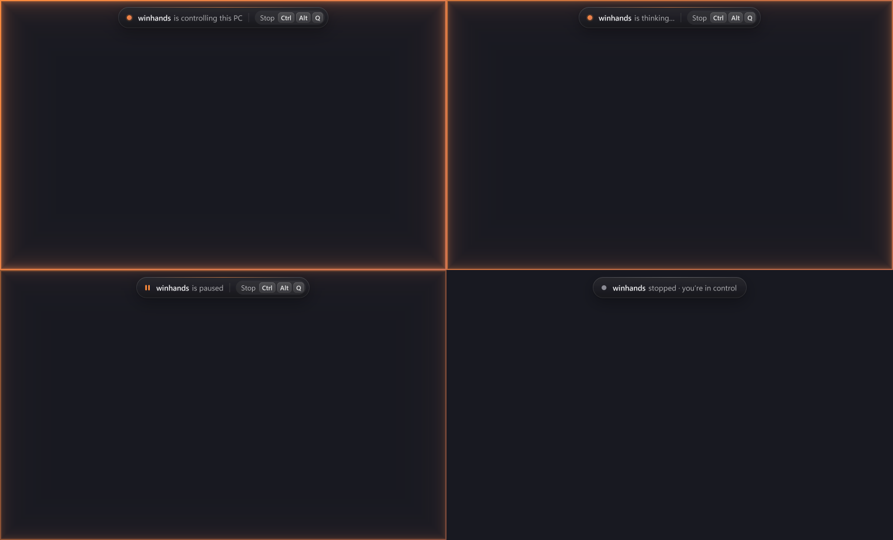
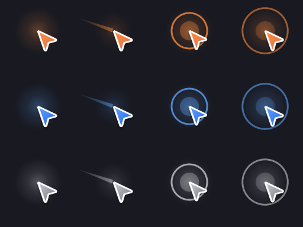

# winhands

[](https://github.com/zredo19/winhands/actions/workflows/ci.yml)
[](https://pypi.org/project/winhands/)

Computer use for Windows: a small MCP server that lets Claude (or any MCP client)
operate any desktop app, draw in canvases and drive games.

## Install

Windows 10 2004+ or 11, and Claude Code or any MCP client. In PowerShell:

```powershell
winget install astral-sh.uv    # once; installs uv, which brings its own Python (check the id with: winget search uv)
uv tool install winhands
winhands setup
```

`winhands setup` registers the MCP server in Claude Code (user scope) and installs the skill into
`~/.claude/skills/winhands`. If `claude` is not on your PATH it prints the config snippet for other MCP clients instead.
Then restart Claude Code and ask it: "open Notepad and type hello".

Already have Python 3.11+? `pip install winhands`, then `winhands setup`.

- Update: `uv tool upgrade winhands`
- Uninstall: `winhands setup --remove`, then `uv tool uninstall winhands`
- See what `setup` would do without changing anything: `winhands setup --dry-run`

### Alternative: one-line installer

Installs uv if missing, then does the same as the commands above. You can read the
[script](install.ps1) first; it needs no admin rights.

```powershell
irm https://raw.githubusercontent.com/zredo19/winhands/main/install.ps1 | iex
```

To uninstall with it:

```powershell
& ([scriptblock]::Create((irm https://raw.githubusercontent.com/zredo19/winhands/main/install.ps1))) -Uninstall
```

Prefer to do it by hand from the repo? See [Manual install](#manual-install).

**"An Application Control policy has blocked this file"** (Spanish Windows: *"Una directiva de Control de aplicaciones bloqueó este archivo"*)
when running `winhands` or `winhands setup`: Windows App Control / Smart App Control blocks unsigned `.exe` launchers such as
`winhands.exe`. winhands registers `python -m winhands`, so it never needs that `.exe`; run setup through the tool's Python instead
(add `--remove` to undo it, `--version` to check that Python itself runs):

```powershell
& (Join-Path (uv tool dir) 'winhands\Scripts\python.exe') -m winhands setup
```


*The overlay while Claude controls the PC: edge glow and status banner in four states (acting, thinking, paused, stopped).*


*The agent cursor at 2x: idle, moving (trail) and click (ripple), in the Claude, Antigravity and Codex palettes.*

Its design follows the computer-use harness of OpenAI's GPT-6 Astra in the Codex/ChatGPT desktop app,
and goes past it where that harness is weak (no key holds, no raw mouse, no local control loops):

1. **Accessibility tree first, pixels when needed.** A Codex-style UI Automation tree
   (`12 button "Save" (focused)`), plus screenshots automatically when a window is canvas-like
   (games, Paint), OCR, grid rulers, Set-of-Marks and burst montages.
2. **Code mode.** The model writes Python in a persistent REPL and batches many actions per turn,
   including local perceive→act loops that run at 10–30 Hz without model round-trips.
3. **Built-in validation.** Every `run` returns a UI diff (or the full tree of a new dialog).
4. **Fail closed.** Element ids are bound to the latest snapshot; changed or vanished targets raise
   `StaleTarget` instead of clicking the wrong thing.
5. **Takeover UX and safety.** An animated edge glow and status banner (acting, thinking, stopped; with the Ctrl+Alt+Q hint)
   on the controlled monitor, plus an agent cursor with a motion trail and click ripple where real input lands, all in the
   client's colour and excluded from screenshots.
   Ctrl+LeftAlt+Q kill switch, and an automatic abort when the user touches mouse or keyboard.
   Held inputs are released on abort, risky actions need confirmation, and some windows are denylisted.
6. **Memory.** Per-app notes and reusable skills (Voyager-style) that persist across sessions.

## Tools (2, ~815 tokens of schema)

| Tool | Modes / helpers |
|---|---|
| `observe(target, mode, region, grid, marks, frames, scale)` | `auto` (tree + shot if canvas-like), `tree`, `both`, `diff`, `shot`, `ocr`, `burst`, `windows` |
| `run(code, timeout, confirm)` | UIA: `click set_value action type key scroll find wait_for focus app windows sh` · Input: `press hold key_down key_up type_keys move move_rel click_at drag wheel release_all` · Vision: `show grab pixel find_color locate save_template ocr find_text click_text click_xy wait_change wait_stable` · Memory: `note notes save_skill skills` |

Input uses `SendInput` with scan codes (DirectInput/raw-input games see real keys) and raw relative
mouse for game cameras. Window capture uses `PrintWindow(PW_RENDERFULLCONTENT)`, so covered windows
are read correctly. Apps launched with `app()` survive the MCP session (launched through WMI,
outside the client's kill-on-close job).

## End-to-end results (real desktop, Windows 10, Spanish UI)

| Test | Result |
|---|---|
| Paint: draw a house (shapes by drag, palette swatches found by color, bucket fills), save PNG | 6/6 layout and color checks pass; one `run` of 11 s |
| Game probe (Chrome, pointer lock): scan codes W/A/S/D/Space/ShiftLeft | all six received as physical key codes |
| Raw relative mouse under pointer lock | sent (70, 30) → page received DX 70, DY 30 exactly |
| Buttons / wheel | L, M, R and wheel −3 received |
| 10 s aim test driven by one local loop (`find_color` → `click_at`) | 88 hits, 6 misses |
| OCR of known Notepad text | 30/34 words (88%) in 118 ms. Misses: the first glyph touching the edit border, and I/l confusion |

## Benchmark vs Windows-MCP

The same tasks run on the same machine, with each server driven the way an optimal agent would use it.
There were 3 reps per task. Script: [`bench/bench.py`](bench/bench.py), raw data:
[`bench/results.json`](bench/results.json).

| Task | Server | Success | Tool calls | Tool time | Tokens returned |
|---|---|---|---|---|---|
| Calculator 123×456 | **winhands** | **3/3** | **2** | **8.0 s** | **603** |
| | Windows-MCP 0.8.5 | 2/3 | 12 | 31.0 s | 6,060 |
| Notepad: type, Save As, verify file | **winhands** | **3/3** | **3** | **12.9 s** | **2,037** |
| | Windows-MCP 0.8.5 | 3/3 | 7 | 21.6 s | 8,601 |

The tool schema is sent on every turn: winhands uses about 815 tokens and Windows-MCP about 4,780.

Notes on method:
- Tokens are estimated: text is chars / 3.5, and images are `ceil(w/28)·ceil(h/28)` per Anthropic's vision docs.
- Tool time excludes model thinking. Each extra call also costs a model turn in a real agent.
- Windows-MCP's snapshot lists only interactive elements of the focused window, so reading the
  calculator result needs a screenshot. Its failed rep missed the calculator in that snapshot.
- Windows-MCP dropped rapid consecutive clicks. A 1 s pause between its clicks, not counted, mimics agent pacing.

## Manual install

Windows 10 2004+ / 11, Python 3.11+. To run the development version from GitHub with [uv](https://docs.astral.sh/uv/):

```powershell
uv tool install --compile-bytecode git+https://github.com/zredo19/winhands
winhands setup
```

`winhands setup` registers the MCP server and installs the skill (perceive → batch → validate, game guidance, safety
rules). To do those two steps yourself: `claude mcp add winhands --scope user -- winhands`, and copy
[`winhands/SKILL.md`](winhands/SKILL.md) to `~/.claude/skills/winhands/SKILL.md`.

Any MCP client works: the server command is just `winhands` (stdio). Set `WINHANDS_OVERLAY=0` to hide the
overlay, `WINHANDS_LINGER=45` for how long it stays up between actions and `WINHANDS_SHARED=0` for strict mode. From source:
`pip install -e .` in a venv, then point the client at `python -m winhands`.

## Safety

- **Ctrl + Left Alt + Q** aborts the running action. AltGr+Q still types `@`.
- Shared mode (default): the user can keep working while a run acts through UIA patterns. Physical input
  that collides with a run driving the real mouse/keyboard aborts it (`UserInterrupt`); real input waits for
  the user to go idle first. The tool never fights the user for control. `WINHANDS_SHARED=0` restores strict mode.
- The low-level keyboard/mouse hooks behind both features exist only while a `run` is acting. Nothing hooks
  system input while the server idles in a Claude Code session.
- Keys are only sent to a verified foreground target. All held keys and buttons are released on any abort.
- `sh()` and clicks on elements named like Send, Buy, Pay, Delete, Install or Allow require `run(..., confirm=True)`.
- Denylisted windows (password managers, banking) are refused.
- `run` executes arbitrary Python: the same privilege as Claude Code's shell tool, gated by the client's permission prompts.
- Online games with anti-cheat: automation may violate their terms and risk a ban. winhands makes
  no attempt to hide or evade detection.

## Limits

- The harness makes a model faster and cheaper on the desktop. It does not make it smarter.
- Reflex gameplay needs local loops written by the model, or pausing the game. Model round-trips take seconds.
- Exclusive-fullscreen games may capture black; use borderless mode. Windows OCR skips isolated single
  characters and glyphs touching strong borders. Template matching is exact-scale.
- Elevated (admin) windows ignore input from a non-elevated server (Windows UIPI).

## Tests

```bash
python -m pytest -q
```
